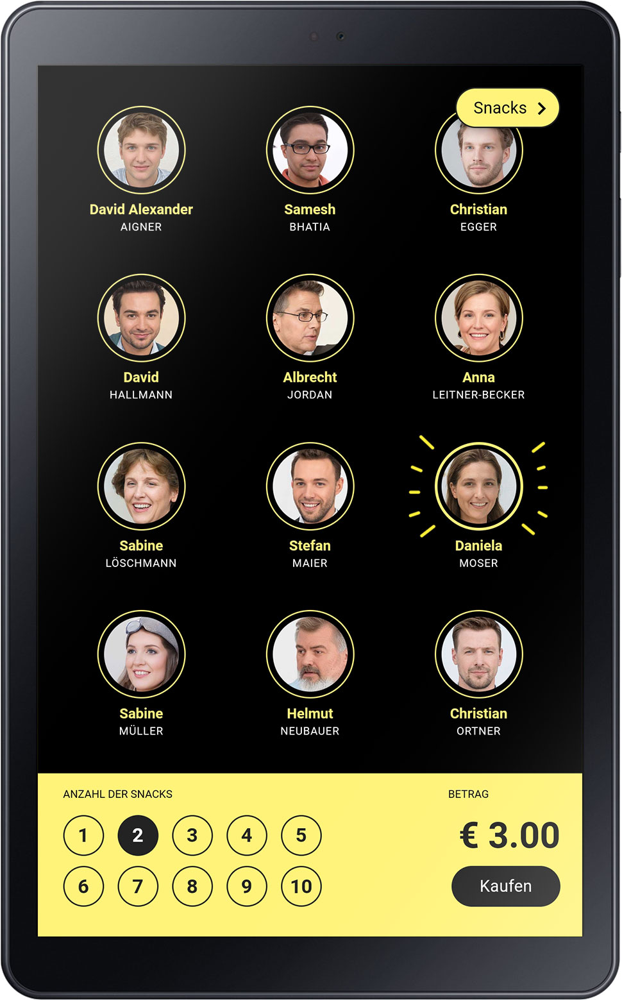
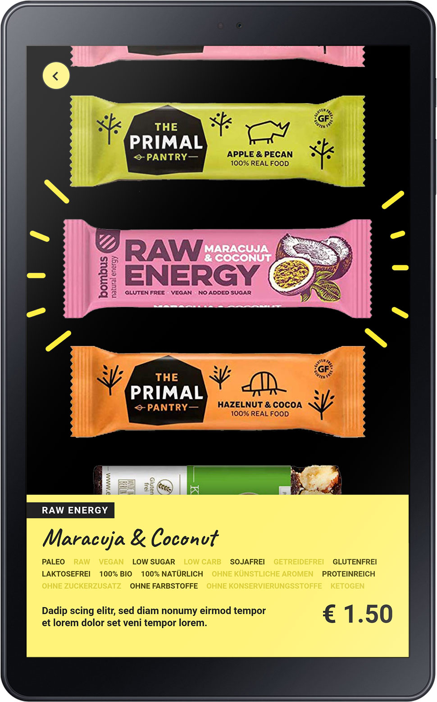

# Brændstof

## What is this?

This non-commercial app was developed as the final project during the [Web Development Bootcamp](https://www.neuefische.de/weiterbildung/web-development) offered by [neue fische GmbH](https://www.neuefische.de) in October 2019. Special thanks fly out to our Head Coach [Jerry](https://badabam.de/)!

## Intended use

The app is designed to be used on a 10,1" android tablet next to the office snackbox [Brændstof](https://braendstof.de). The app enables employees to book their consumed snacks and provides additional snack information such as ingredients, nutritional value, price and more.

## Preview




## Tech stack

Brændstof was built using the **MERN Stack**:

- [**M**ongoDB](https://www.mongodb.com/)
- [**E**xpress.js](https://expressjs.com/)
- [**R**eact.js](https://reactjs.org/)
- [**N**ode.js](https://nodejs.org/)

## Additional dependencies

- [cors](https://www.npmjs.com/package/cors)
- [mongoose](https://mongoosejs.com/)
- [nodemon](https://nodemon.io/)
- [npm-run-all](https://www.npmjs.com/package/npm-run-all)
- [PropTypes](https://www.npmjs.com/package/prop-types)
- [react-router-dom](https://www.npmjs.com/package/react-router-dom)
- [Storybook](https://storybook.js.org/)
- [styled-components](https://www.styled-components.com/)
- [styled-icons](https://styled-icons.js.org/)

## Requirements

- Node.js
- MongoDB running on `localhost:27017`
- Cloudinary account

## How to install

1. Clone this repository into a new folder
   ```
   git clone git@github.com:sygnalcode/braendstof.git my-new-folder
   ```
2. Run npm install to receive the necessary packages
   ```
   cd my-new-folder
   npm install
   ```
3. Start the local webserver
   ```
   npm start
   ```
4. Run storybook
   ```
   npm run storybook
   ```

## Designated devices

Samsung Galaxy Tab A 10,1“ (2019) in portrait view.

## License

Not licensed yet.

## Credits

- AI user photos by [Generated Photos](https://generated.photos/).
- Icons by [Boxicons](https://boxicons.com/).

## Author contact

Don’t hesitate to get in touch if you have any questions or issues:<br>
[hello@sygnal.de](mailto:hello@sygnal.de)
